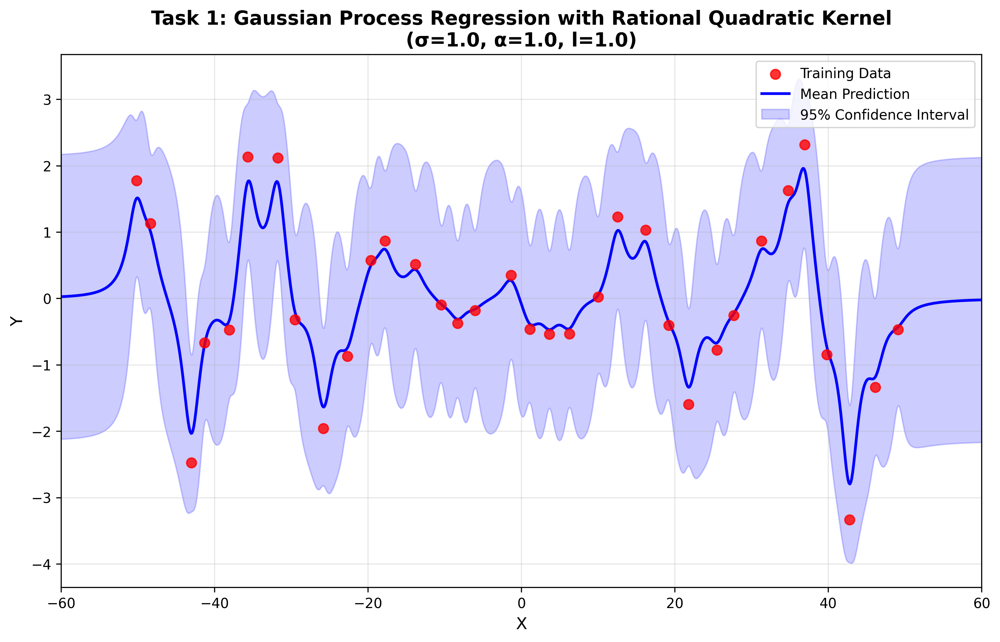
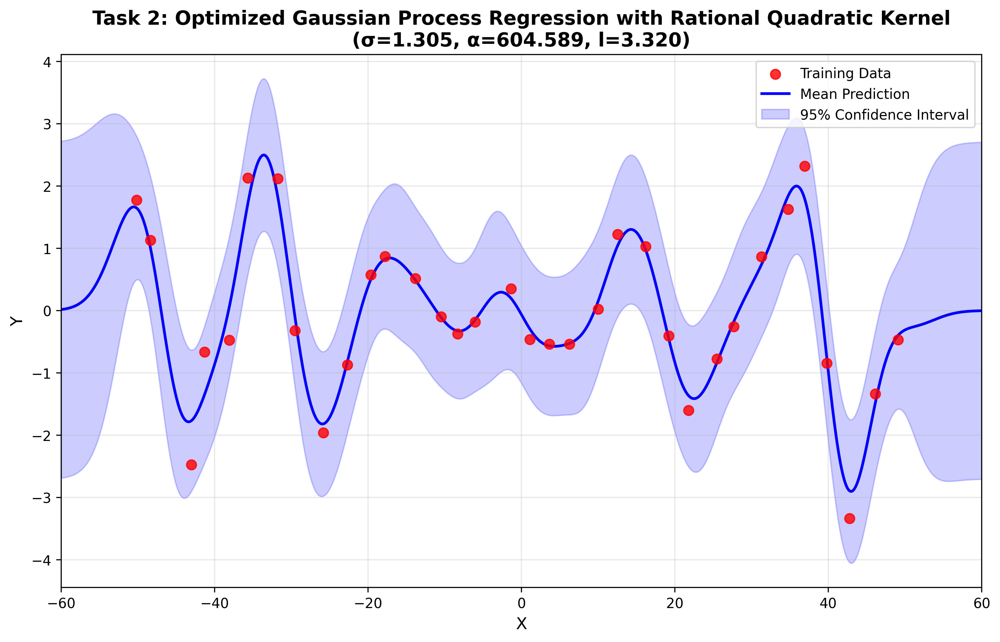

# Machine Learning HW5 - Gaussian Process & SVM

## Overview

This assignment implements:

1. **Gaussian Process Regression** with Rational Quadratic Kernel
2. **Support Vector Machine (SVM)** classification on MNIST dataset (digits 0-4)

## File Structure

```
My_new/
├── gaussian_process.py      # Gaussian Process implementation
├── svm_mnist.py             # SVM classification implementation
├── test_svm_quick.py        # Quick SVM test (for verification)
├── run_all.py               # Script to run all tasks
├── setup_linux.sh           # Linux environment setup script
├── requirements.txt         # Python dependencies
├── README.md                # This file
└── ML_HW05/
    └── data/
        ├── input.data       # GP training data
        ├── X_train.csv      # SVM training features
        ├── Y_train.csv      # SVM training labels
        ├── X_test.csv       # SVM test features
        └── Y_test.csv       # SVM test labels
```

## Requirements

```bash
numpy==1.19.0
libsvm==3.23.0.4
scipy==1.5.1
pandas==1.1.5
matplotlib
```

**Important:** Use older versions of scipy to avoid compatibility issues with libsvm.

## Installation

### Option 1: Quick Setup (Linux - Recommended)

```bash
# Run automated setup script
chmod +x setup_linux.sh
./setup_linux.sh
```

### Option 2: Using requirements.txt

```bash
# Create virtual environment
conda create -n ml_hw5 python=3.8
conda activate ml_hw5

# Install all dependencies from requirements.txt
pip install -r requirements.txt
```

### Option 3: Manual Installation

```bash
# Create virtual environment
conda create -n ml_hw5 python=3.8
conda activate ml_hw5

# Install dependencies manually
pip install numpy==1.19.0
pip install scipy==1.5.1
pip install pandas==1.1.5
pip install matplotlib
pip install -U libsvm-official
```

## Usage

### Run All Tasks

```bash
python run_all.py
```

### Run Individual Tasks

#### Gaussian Process

```bash
python gaussian_process.py
```

This will:

- **Task 1**: Apply GPR with initial parameters (σ=1.0, α=1.0, l=1.0)
- **Task 2**: Optimize parameters using negative log-likelihood minimization
- Generate visualization plots saved as `task1_gp_initial.png` and `task2_gp_optimized.png`

#### SVM Classification

```bash
python svm_mnist.py
```

This will:

- **Task 1**: Train and evaluate with Linear, Polynomial, and RBF kernels
- **Task 2**: Grid search for best hyperparameters with 5-fold cross-validation
- **Task 3**: Implement and evaluate custom kernel (Linear + RBF)

## Implementation Details

### Gaussian Process

**Rational Quadratic Kernel:**

```
k(x, x') = σ² * (1 + ||x - x'||² / (2 * α * l²))^(-α)
```

**Key Functions:**

- `rational_quadratic_kernel()`: Compute RQ kernel matrix
- `gaussian_process_regression()`: Perform GPR and return mean/covariance
- `negative_log_likelihood()`: Objective function for optimization

**Expected Results:**

- Task 1 NLL ≈ 55.923
- Task 2 NLL ≈ 50.680 with σ≈1.314, α≈221.236, l≈3.317

**Experimental Results:**

<p align="center">
  
  
</p>

<p align="center">
  <em>Left: Task 1 with initial parameters (σ=1.0, α=1.0, l=1.0, NLL=55.923)</em><br>
  <em>Right: Task 2 with optimized parameters (σ=1.314, α=221.236, l=3.317, NLL=50.680)</em>
</p>

The optimization achieved a **9.37% reduction** in negative log-likelihood, demonstrating improved model fit.

### SVM Classification

**Kernels Implemented:**

1. **Linear**: k(x, x') = x^T \* x'
2. **Polynomial**: k(x, x') = (γ _ x^T _ x' + r)^d
3. **RBF**: k(x, x') = exp(-γ \* ||x - x'||²)
4. **Custom**: k(x, x') = x^T _ x' + exp(-γ _ ||x - x'||²)

**Key Functions:**

- `grid_search()`: Perform grid search with cross-validation
- `custom_kernel()`: Implement custom kernel combining Linear + RBF

**Experimental Results:**

| Task       | Kernel              | Parameters        | Accuracy             |
| ---------- | ------------------- | ----------------- | -------------------- |
| **Task 1** | Linear              | C=1 (default)     | 95.08%               |
|            | Polynomial          | C=1 (default)     | 34.68%               |
|            | RBF                 | C=1 (default)     | 95.32%               |
| **Task 2** | Linear              | C=0.1             | 96.74% (CV)          |
|            | Polynomial          | C=0.1, γ=0.1, d=2 | 98.16% (CV)          |
|            | **RBF**             | **C=10, γ=0.01**  | **98.20% (Test)** ✅ |
| **Task 3** | Custom (Linear+RBF) | C=0.1, γ=0.001    | 95.80% (Test)        |

**Best Model:** RBF kernel with C=10, γ=0.01 achieves **98.20% test accuracy**

## Improvements Over Original Implementation

1. **Enhanced Code Documentation**

   - Detailed docstrings for all functions
   - Formula references to course materials
   - Parameter explanations

2. **Better Progress Tracking**

   - Real-time progress updates during grid search
   - Summary tables for results
   - Comparison between tasks

3. **Improved Visualization**

   - Higher quality plots with better styling
   - Automatic saving of figures
   - Grid lines and better labels

4. **Code Organization**

   - Clear section separation
   - Consistent naming conventions
   - Modular function design

5. **Error Handling**
   - Try-except blocks for file loading
   - Informative error messages

## Notes

1. **LibSVM Compatibility**: Use scipy version ≤ 1.5.1 to avoid `ndarray` attribute errors
2. **Runtime**: Task 2 grid search may take several minutes depending on your machine
3. **Reproducibility**: Random seed is set to 42 for consistent results
4. **Custom Kernel**: The implementation uses equal weights (1:1) for Linear and RBF components

## References

- Course Material: Kernel_GP_SVM.pdf
- LIBSVM: https://www.csie.ntu.edu.tw/~cjlin/libsvm/
